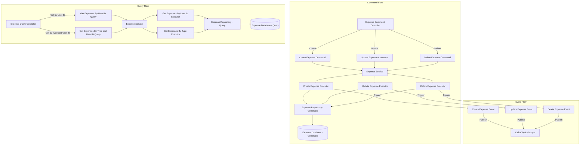
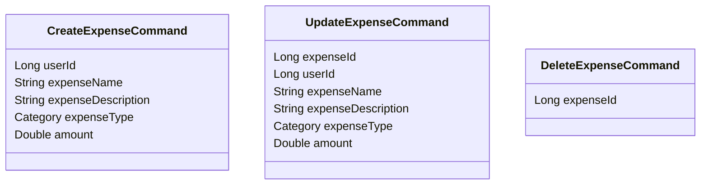
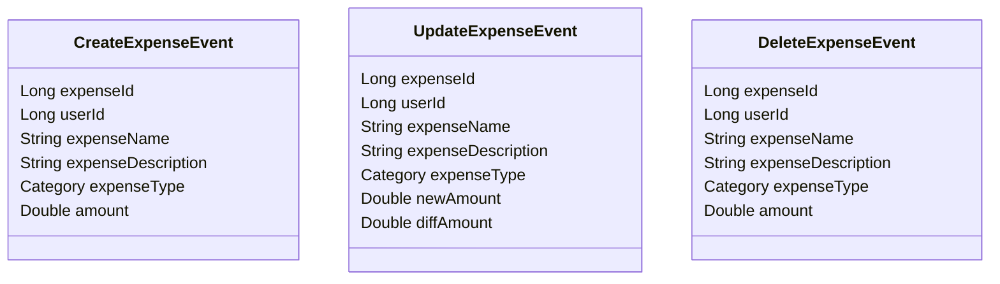
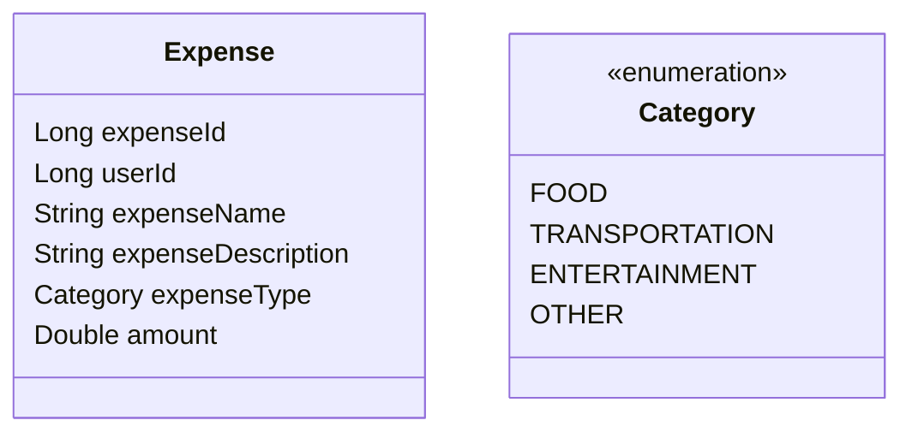
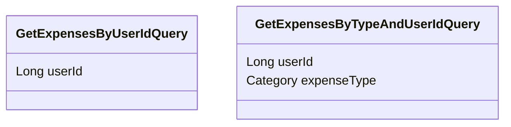

# Expense Management System

This project is an Expense Management System that follows the Command-Query-Responsibility-Segregation (CQRS) pattern using Spring Boot. The system manages the lifecycle of expenses including creation, updating, deletion, and querying, with events triggered for each operation.

## Event-Driven Architecture

This system leverages an event-driven architecture where commands initiate changes, and corresponding events are triggered to reflect those changes across the system. This approach decouples the components, making the system more scalable, responsive, and easy to maintain.

### Process Flow Diagram



### Class Diagrams with Descriptions

#### Command Classes
Commands represent actions to be performed, such as creating, updating, or deleting an expense. They are used to request changes in the system.



#### Event Classes
Events are triggered after commands are executed, capturing the results of those actions. They notify the system that a significant change has occurred, which can be used to update other components.



#### Entity Class
Entities represent the data model of the system, such as an `Expense`. They define the structure and attributes of the data that is stored and managed within the system.



#### Query Classes
Queries are used to retrieve information from the system, such as fetching expenses based on certain criteria. They do not change the state of the system but are essential for providing data to users and other components.



### Controllers
Controllers handle incoming HTTP requests and map them to the appropriate commands, queries, or events. The `ExpenseCommandController` manages commands related to expenses, while the `ExpenseQueryController` manages queries. These controllers serve as the entry points to the system's functionality, exposing the API to the outside world.

## Getting Started

To run the service locally:

1. **Clone the repository**:
   ```bash
   git clone https://github.com/viswarajramji/expense.git
   cd expense
   ```

2. **Build the application**:
   ```bash
   ./mvnw clean install
   ```

3. **Start the application**:
   ```bash
   ./mvnw spring-boot:run
   ```

4. **Access the application** at `http://localhost:8084`.

5. **Access the database** at `http://localhost:8084/h2-console`.

**Note**: Ensure Kafka is running and the topic `expenseservice` is created.

## Swagger Endpoint

Access the Swagger UI to interact with the API:

- **URL**: `http://localhost:8084/swagger-ui.html`
