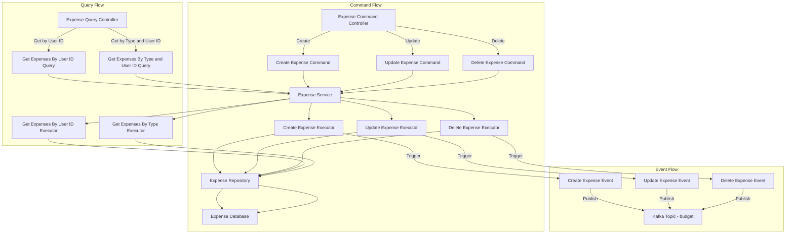
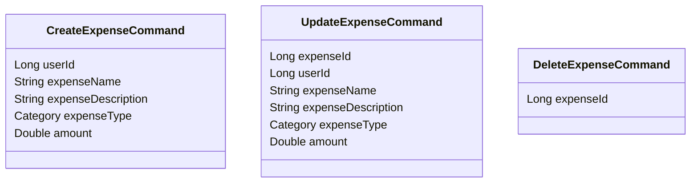
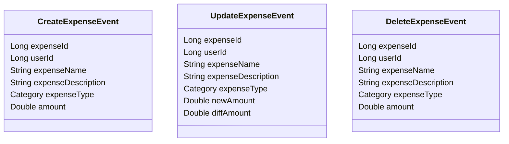
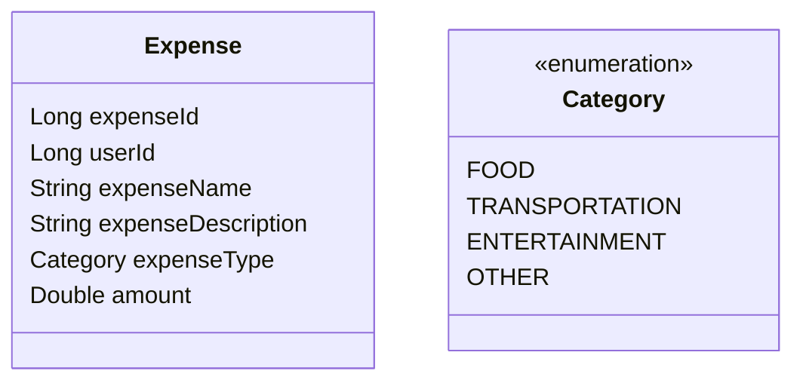
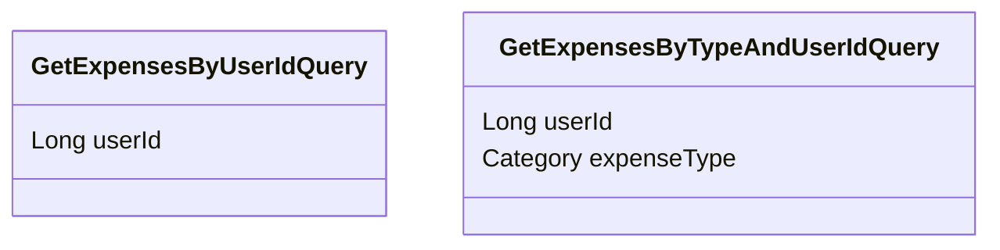

# Expense Management System

This project is an Expense Management System that follows the Command-Query-Responsibility-Segregation (CQRS) pattern using Spring Boot. The system manages the lifecycle of expenses including creation, updating, deletion, and querying, with events triggered for each operation.

## Running the Project

### Prerequisites

- Java 11 or higher
- Maven 3.x

### Steps to Run

1. **Clone the Repository**:
   ```sh
   git clone https://github.com/your-username/expense-management-system.git
   cd expense-management-system
   ```

2. **Build the Project**:
   Use Maven to build the project:
   ```sh
   mvn clean install
   ```

3. **Run the Application**:
   Start the Spring Boot application:
   ```sh
   mvn spring-boot:run
   ```

4. **Access the API**:
   The application runs on `http://localhost:8080`. You can interact with the API using tools like Postman or cURL.

### Process Flow Diagram



### Class Diagrams

#### Command Classes



#### Event Classes



#### Entity Class



#### Query Classes



